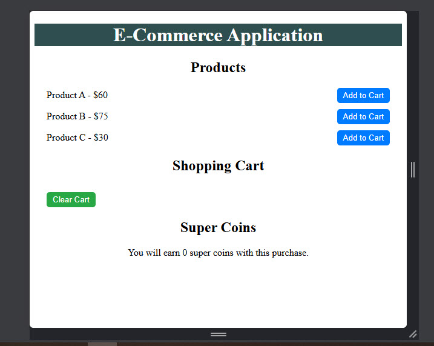
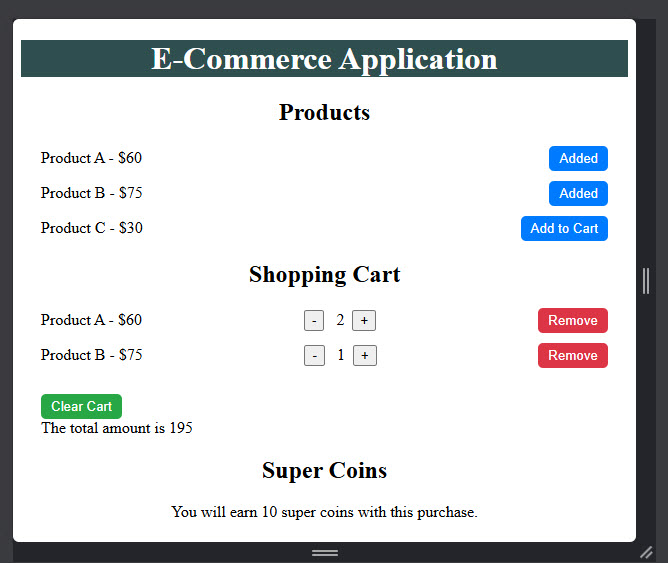

# Ecommerce Redux Toolkit

visit the site: https://ramirezjm.github.io/ecommerce_redux_toolkit/

Simple E-Commerce application using React and Redux that:

* It displays a list of products with an "Add to Cart" button for each product
* It displays the items added to the cart
* It allows users to remove items from the cart

All the information is going to be globally available throughout the application using Redux Toolkit.

  

  

